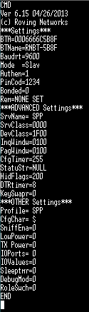

# Présentation des modules RN42

Pour accéder à la configuration d'un RN42, il faut lui envoyer `$$$` par UART. Le module est alors censé répondre par `CMD`. A partir de ce moment, on peut lui envoyer des instructions suivies d'un retour à la ligne. L'instruction `---` permet de sortir du mode commande.

L'instruction `X` demande au module d'afficher sa configuration actuelle, par exemple :

On remarque alors que ce module est configuré en 9600 Baud, qu'il est en mode Slave et que son adresse BT est `0006666C5B8F`.

Par défaut, les modules sont livrés avec la vitesse de 115200 Baud. Cette vitesse était trop elevée pour transmettre sans erreurs dans notre cas, il est donc important de **configurer le module en 9600 Baud**.

Pour cela, il faut envoyer la commande `SU, 96`, sur les deux modules qui seront utilisés. (attention, à partir du prochain reboot du module, il faudra lui communiquer en 9600 Baud)

Ensuite, il faut alors choisir un module qui sera connecté à la carte Slave, et un module à la carte Master.

Après avoir initié le mode commande avec `$$$` (la LED clignote rapidement), il faut communiquer les configurations suivantes aux RN42 :

#### Pour la carte master, la configuration est

`SU,96` (passage en 9600 Baud)

`SM,3` (mode Auto-connect Master)

`IN5` (recherche des adresses des modules BT environnants)

`C,<addresse>` (connexion à l'adresse)

Si la connexion réussit, le module sort automatiquement du mode commande et sa LED ne doit plus clignoter. Tout ce qui est envoyé sur l'UART est alors transmis entre les modules.

#### Pour la carte slave, la configuration est

`SU,96` (passage en 9600 Baud)

`SM,1` (mode Slave)