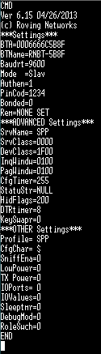
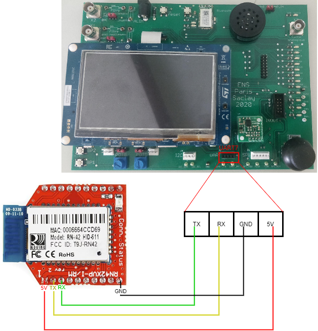

# Présentation et utilisation des modules bluetooth RN42

Les modules bluetooth RN42 sont faits pour faciliter l'utilisation du bluetooth, ceux-ci sont capables de prendre en entrée un format UART et de directement transmettre le contenu via bluetooth. Cependant, il faut tout de même leur spécifier quelques paramètres pour pouvoir les interconnecter.

Pour accéder à la configuration d'un RN42, il faut lui envoyer `$$$` par UART. Le module est alors censé répondre par `CMD`. A partir de ce moment, on peut lui envoyer des instructions suivies d'un retour à la ligne. L'instruction `---` permet de sortir du mode commande.

L'instruction `X` demande au module d'afficher sa configuration actuelle, par exemple :

On remarque alors que ce module est configuré en 9600 Baud, qu'il est en mode Slave et que son adresse BT est `0006666C5B8F`. Voilà les seuls paramètres qui seront utiles dans notre cadre.

Par défaut, les modules sont livrés avec la vitesse de 115200 Baud. Cette vitesse était trop elevée pour transmettre sans erreurs dans notre cas, il est donc important de **configurer le module en 9600 Baud**.

Un résumé des paramètres à éditer pour pouvoir utiliser ces modules dans le cadre du Pong2DBT est fourni ci-dessous.

## Configuration initiale des RN42

Les modules doivent être configurés selon les critères suivants. Pour rappel, l'accès au mode configuration se fait en envoyant `$$$` (115200 Baud pour un module neuf, 9600 Baud après configuration), et les commandes sont ensuites validées avec un retour à la ligne. Pour sortir, la commande est `---`

En mode configuration, la LED intégrée clignote rapidement.

Pour la configuration, il faudra avoir recours à un terminal série sur un PC (par ex TeraTerm, en 115200 Baud). Le branchement au RN42 peut se faire soit par dongle UART, soit en utilisant la branche `command-interface` est une version suspendue du programme qui fait l'interface avec un terminal série USB sur le PC et l'UART7 du STM32.

##### Module pour la carte Master
- 9600 Baud
	- `SU,96`
- Mode Auto (3)
	- `SM,3`
- Adresse du Slave pré-enregistrée (registre R)
	- `IN5` (recherche des adresses environnantes)
	- `C,<addresse>` (connexion et enregistrement à l'adresse)
##### Module pour la carte Slave
- 9600 Baud
	- `SU,96`
- Mode Slave (0)
	- `SM,0`

## Utilisation dans le cadre du Pong 2DBT

Une fois la configuration initiale faite, les modules enregistrent celle-ci et le mode Auto permet d'initier la connexion automatiquement dès leur alimentation. Attention, il faut cependant veiller à brancher les bons modules sur la bonne carte.

Un avantage de ce fonctionnement automatique est que les programmes faits peuvent à la fois communiquer via les modules bluetooth ou directement en UART via câbles, sans nécessiter la moindre modification.

Le schéma de câblage sur l'UART7 depuis la carte de l'ENS se fait comme suit

En cas de difficultés avec les RN42, il est donc possible d'avoir recours au bon vieux mais fiable fil électrique.